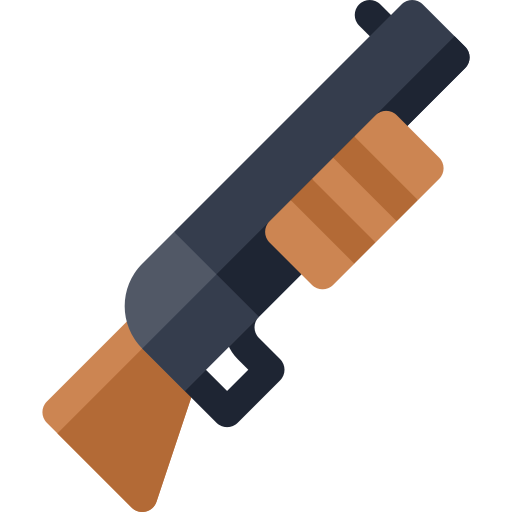

<a name="readme-top"></a>

<br />
<div align="center">
    

  <h3 align="center">OpenGL FPS</h3>

  <p align="center">
    This repository is a simple FPS game made in C using OpenGL and SDL2.
  </p>
</div>

<details>
  <summary>Table of contents</summary>
  <ol>
    <li>
      <a href="#about">About</a>
      <ul>
        <li><a href="#about-sdl2">About SDL2</a></li>
        <li><a href="#built-with">Built with</a></li>
      </ul>
    </li>
    <li>
      <a href="#getting-started">Getting started</a>
      <ul>
        <li><a href="#prerequisites">Prerequisites</a></li>
        <li><a href="#installation">Installing</a></li>
      </ul>
    </li>
    <li>
      <a href="#usage">Usage</a>
      <ul>
        <li><a href="#gameplay">Gameplay</a></li>
        <li><a href="#bindings">Bindings</a></li>
      </ul>
    </li>
    <li>
      <a href="#product">Product</a>
      <ul>
        <li><a href="#mvp">MVP</a></li>
        <li><a href="#roadmap">Roadmap</a></li>
        <li><a href="#known-issues">Known issues</a></li>
      </ul>
    </li>
  </ol>
</details>


## About
<a name="about"></a>

The idea behind this project is to play with 3D graphics in a low-level approach. This is an FPS game, built without a game engine. This also allows for extensive optimization.

So I chose the C language, which I like, along with a library: SDL2, to use OpenGL in a platform-independent context. With this, rendering methods are almost non-existent, and I have to start from scratch (although SDL can take some of the work out of the equation).

The primitive rules imposed here shouldn't affect the quality of the game, which I hope will resemble a modern FPS rather than the first Doom. The game should include mechanics familiar from today's FPS.

<p align="right">(<a href="#readme-top">Up</a>)</p>

### About SDL2
<a name="about-sdl2"></a>

#### Context

In order to display elements on the screen, modern computer architecture requires a polite request to the graphics drivers. This is usually done via standardized languages called specifications. The best-known are DirectX, Vulkan and OpenGL. Even though Vulkan is the most recent, the most optimized and the most adapted to current technologies, it requires a great deal of time and energy to operate. OpenGL is much easier to learn and use, making it suitable for a development team consisting of one person developing in their spare time. Please note that OpenGL still allowd for a sufficient level of optimisation.

> OpenGL® is the most widely adopted 2D and 3D graphics API in the industry, bringing thousands of applications to a wide variety of computer platforms. It is window-system and operating-system independent as well as network-transparent. OpenGL enables developers of software for PC, workstation, and supercomputing hardware to create high-performance, visually compelling graphics software application

on *khronos.org*

#### SDL

> Simple DirectMedia Layer is a cross-platform development library designed to provide low level access to audio, keyboard, mouse, joystick, and graphics hardware via OpenGL and Direct3D.

on *libsdl.org*

To interact with the rest of the computer, you need to use the API provided by the OS developers. As these are highly OS-dependent, the same code must be replicated for each targeted OS.

In order to make the game as cross-platform as possible, to avoid the pain of using Win32, or to avoid rewriting code 3 times for Linux and macOS, I chose to use an external library. In any case, the library is surely much more optimized than it would have been if I'd done it myself.
Among the various choices available for these libraries (GLFW, GLUT, SFML, ...), one stands out:

- SDL2 is renowned for its lightweight design, which ensures efficient resource utilization without compromising performance.

- One of the key advantages of SDL2 is its provision of low-level access to audio drivers, and input devices.

- SDL2's cross-platform compatibility makes it easy to seamlessly operate on various operating systems, including Windows, macOS, Linux, iOS and Android.

Overall, I think SDL2 is best suited to video game design.

<p align="right">(<a href="#readme-top">Up</a>)</p>

### Built with
<a name="built-with"></a>

* [C][c-url] (Standard C17)
* [Assimp][assimp-url] (5.3.1)
* [cglm][cglm-url] (0.9.2)
* [GLEW][glew-url] (2.1.0)
* [SDL2][sdl-url] (2.28.5)
* [SDL_mixer][sdl_mixer-url] (2.6.3)

#### Quick note

Assimp stands for Asset Importer Library. It's a library that makes it extremely easy to import 3D files, such as models or animations. Even if the import itself isn't among the fastest, I chose this library because it also offers post-processing operations, such as optimizing models for lighter real-time rendering.

cglm stands for OpenGL Mathematics (glm) for C. It is a highly optimized 2D/3D math library. It offers a wide range of functions that make it quick and easy to use mathematics in an OpenGL/Vulkan context. The library takes advantage of SIMD operations when supported by the processor (SSE and SSE2 are supported by all modern x86 processors anyway).

GLEW stands for OpenGL Extension Wrangler. It is an extension that loads OpenGL function headers :
as stated before, OpenGL's implementation is the responsibility of the card manufacturer. GLEW takes care of retrieving and normalizing function names.

> GLEW provides efficient run-time mechanisms for determining which OpenGL extensions are supported on the target platform. OpenGL core and extension functionality is exposed in a single header file.

on *glew.curseforge.net*

SDL_mixer is not part of the default SDL library. However, it is an official SDL extension promoted on the SDL website.
It is also practically indispensable when developing a game, as it allows several sounds to be played at the same time, which is impossible with SDL alone.
Once again, it would have been possible to do without, but it would have required extra time to reimplement what someone has already done, and better than me!

<p align="right">(<a href="#readme-top">Up</a>)</p>


## Getting started
<a name="getting-started"></a>

#### Try the game

Game files are no longer hosted on Github, due to the sheer size of the assets. You can download them here : **Not available for now**.

Please note that, for now, game files are only compatible with 64-bit Windows systems (probably only for AMD CPUs). Pre-compiled versions of the game will be available in the future for Linux and macOS.

For the moment, no interface or menu has been implemented, so that there's no way to change key bindings from within the game.

Current bindings are detailed in <a href="#usage">Usage</a>.

#### Edit code

Otherwise, follow these steps:

<p align="right">(<a href="#readme-top">Up</a>)</p>

### Prerequisites
<a name="prerequisites"></a>

* C : Any compiler will do. I personally used GCC 13.2.0 through [WinLibs][winlibs-url].
* Assimp : Assimp doesn't provide binaries, this means you need to download their source code and build them yourself. See their [website](https://assimp-docs.readthedocs.io/en/latest/about/quickstart.html#building-the-library-from-scratch) for more information.
* cglm : Download latest release on GitHub. Please note that cglm is a header-only library (at least, I'll only be using inline functions).
* GLEW : Download GLEW binaries on their website.
* SDL2 : Download the development (`devel`) version of SDL2.
* SDL_mixer : Download the development (`devel`) version of SDL_mixer.

### Installation
<a name="installation"></a>

1. Clone the repository
  ```sh
  git clone https://github.com/Dozer35/retro-fps.git
  ```

  or download code as Zip.

2. Add the `include` and `lib` directories of the SDL library files you downloaded earlier to `src`. Also put the content of the `bin` folder (`build/SDL2.dll` for Windows or `build/SDL2.so` for Linux) inside of `build`
  The project tree should then contain :
  - `src/include/SDL2/*.h`
  - `src/lib/*.a`
  - `build/SDL2.dll`

    Follow the same procedure for SDL_mixer, GLEW and Assimp.

    As for cglm, all you have to do is add `cglm/*.h` to `include/cglm` and just include the header `<cglm/cglm.h>` (and nothing else !).
3. WINDOWS - Compile the project with :
  ```sh
    gcc -Wall -std=c17 -I src/include -L src/lib -o build/fps src/main.c $(Get-ChildItem -Recurse -Path src/include -Filter \"*.c\").FullName -lmingw32 -lSDL2main -lSDL2 -lSDL2_mixer -lopengl32 -lglew32 -lassimp
  ```
  If you don't want the program to open a console, add `-mwindows`.


  UNIX - A Makefile is available. Alternatively, compile the project with :

  ```
    gcc -Wall -std=c17 -I src/include -L src/lib -o build/fps src/main.c $(find src/include -name "*.c") -lmingw32 -lSDL2main -lSDL2 -lSDL2_mixer -lopengl32 -lglew32 -lassimp
  ```
  A compiled file will then be generated as `build/retro_fps` or `build/retro_fps.exe`, depending on your OS.

4. Please note that game assets are no longer hosted on Github, due to their sheer size. You can download them here : **Not available for now**.


<p align="right">(<a href="#readme-top">Up</a>)</p>

## Usage
<a name="usage"></a>

### Gameplay
<a name="gameplay"></a>

In its current state, the game only allows you to move freely in a placeholder level, containing various elements.

<p align="right">(<a href="#readme-top">Up</a>)</p>

### Bindings
<a name="bindings"></a>

It is currently not possible to change default bindings without modifying `src/main.c` and recompiling the whole code.
In the future, the player should be able to modify its bindings in-game.

By default, the bindings are :
- H - Forward
- B - Reverse
- V - Left
- N - Right
- Space - Jump
- Left click - Shoot (Not fully implemented)

- Esc - Pause the game
- F1 - Close the game

Other bindings are set in the game files, but they are not used yet.

<p align="right">(<a href="#readme-top">Up</a>)</p>

## Product
<a name="product"></a>

This section organizes the development process, defining a minimal viable product and a roadmap for development.

### MVP
<a name="mvp"></a>

Achieving the Minimum Viable Product would already be a success. Further development is not guaranteed and may depend on factors such as development time, will or other external factors (free time, ...).

MVP should be a classic, straightforward FPS in the spirit of Doom :
- First-person camera
- Guns
- Enemies
- Sound effects

Overall, the game MUST be playable and enjoyable.

<p align="right">(<a href="#readme-top">Up</a>)</p>

### Roadmap
<a name="roadmap"></a>

This roadmap helps organizing development and may be subject to change.

- [X] Opening a window
- [X] First Person Camera
- [X] Import models
- [ ] Gun
- [ ] Level rendering
- [ ] Audio
- [ ] Collisions
- [ ] Health packs and ammo
- [ ] Enemies
- [ ] MVP
- [ ] Better lights
- [ ] Level editor
- [ ] New functionalities

<p align="right">(<a href="#readme-top">Up</a>)</p>

### Known Issues
<a name="known-issues"></a>

Various problems and bugs may arise during development. If no obvious solution is found, they are listed here. If you come across another bug not listed, please report it using the Issues tab.
- Light is temporarily ugly, it will be repaired very soon.

<p align="right">(<a href="#readme-top">Up</a>)</p>


[c-url]: https://fr.wikipedia.org/wiki/C_(langage)
[assimp-url]: https://assimp.org/
[cglm-url]: https://github.com/recp/cglm
[glew-url]: https://glew.sourceforge.net/
[sdl-url]: https://www.libsdl.org/
[sdl_mixer-url]: https://github.com/libsdl-org/SDL_mixer
[winlibs-url]: https://winlibs.com/#download-release